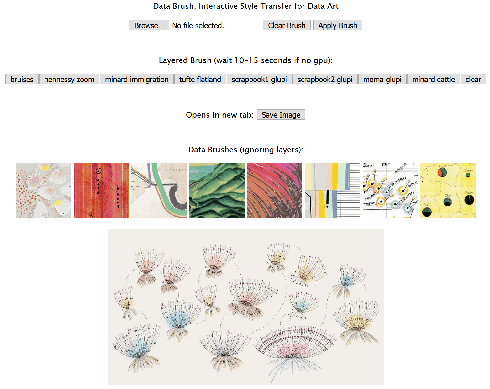

# Data Brushes: Interactive Style Transfer for Data Art
Brush-based interactive canvas for custom style transfer. We have two different modes of the application that can be loaded from each folder in this repository. Our style transfer applications use pre-trained models from ml5.js and brush interactions supported by D3 in novel ways, giving users a new way to creatively interact with images of their choice, and eliciting new thoughts on the process of art creation. The application is accessible at https://mahikadubey.github.io/Canvas-Style-Transfer/. Our paper is currently under review for the IEEE Vis Arts Program 2019. 

Contact Information:  
Mahika Dubey     
Graduate Researcher     
Creative Coding Lab     
University of California Santa Cruz         
mahika@ucsc.edu  

Jasmine Otto    
Graduate Researcher      
Creative Coding Lab     
University of California Santa Cruz    
jtotto@ucsc.edu    

Angus G. Forbes    
Assistant Professor and Lab Director   
Creative Coding Lab         
University of California Santa Cruz         
angus@ucsc.edu     

## Magic Marker  
The Magic Marker application allows brush interactions so that users can 'paint' on different data styles through intuitive selection and dragging. The image below shows the initial state of the application upon opening. 

Select a brush to switch to the relevant style. Rectangle shaped selections can be made on the canvas, and dragged around or reshaped as needed. When happy with the painted section, click the 'Apply Brush' button to fix the changes to the image. Then, a new brush may be selected, or a new section may be painted over with the existing brush. Use the 'Clear Brush' button to remove any un-applied 'paint.' Using 'content replacing' overwrites any previously styled content with the single selected style, while 'style layering' allows multiple styles to be applied onto the same area, successively styling and re-styling for creative outputs. 

### Results - Images and Video Demo   
Below is a video/gif demonstrating usage of the magic marker implementation, as well as image results of other paintings created using the application.    

### Implementation Details
This application uses scaled down images to avoid crashing the browser (images smaller than 2400 by 2400 pixels work best as we scale down by a factor of 3). Upon selection of a brush, a hidden canvas is processed using the entire image as the content for the selected style. Brush interactions effectively remove pixels from the top canvas to reveal the transformed image content in the 'painted' areas, such that the top canvas layer acts like a mask to the styled image on the canvas below. The 'Apply Brush' button combines the result of the masked style canvas image, and 'flattens' the canvases to reset the underlying image content. If changes have not been applied, the 'Clear Brush' button resets the top canvas layer by reversing the pixel removal. 

## Compositing Stamps
The Compositing Stamps application uses real time transfer of selected sections of an image to layer on patches of style to create interesting works of art resembling tiled mosaics or collages. Users can select different rectangular sections of their image of choice using a brush to get immediate transformation of content based on the selected style. The image below shoes the intial state of the application when opened. Due to browser limitations, it is recommended to avoid creating brush selections larger than 800x800 pixels. 

Select a brush to switch to the relevant style, and use the mouse to click and drag to select a rectangular shape. This patch will be replaced with a stylized version of the original content using the brush style selected by the user. Rectangular brush selections can be moved around the canvas, but the content will only be sent to the style transfer library on a mouse up event. 'Apply Brush' sticks the changes to the canvas, 'Clear Brush' removes the brush box from the canvas area, and 'Clear Image' removes any un-applied changes from the preview layer.

### Results - Images and Video
Below is a video/gif demonstrating the usage of the patch painting application, along with a set of example results of multi-style patch paintings.   

### Implementation Details
This application uses brush selections to send portions of an image to ml5 for style transfer to be completed piece-wise across the canvas. A preview canvas is layered on top of the image canvas to hold pixel data for applied style patches. The 'Apply Brush' button flattens these changes and sticks them to the underlying image content. If changes have not been applied, the 'Clear Brush' button resets the preview canvas layer by clearing the changes. 

## How to run locally
- Clone the repository and open a terminal in the main directory
- Run a local server using `python -m http.server` (if using Python 2, use `python -m SimpleHTTPServer` instead)
- Open http://localhost:8000 in a browser 
- You will have the option to choose between Magic Markers or Compositing Stamps

